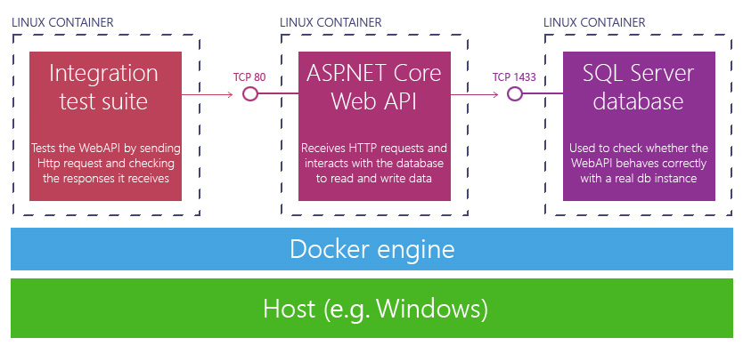
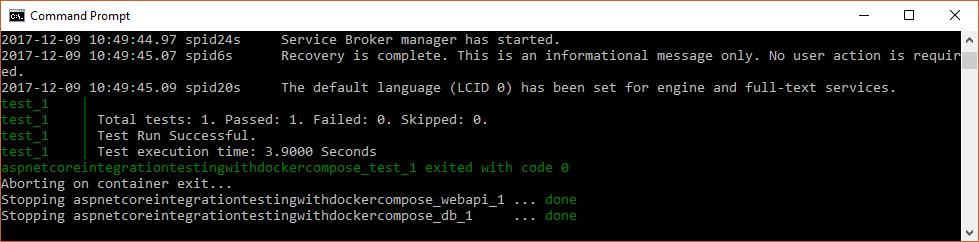

# ASP.NET Core integration testing with docker-compose
This project demonstrates how an ASP.NET Core application developed on Windows can be tested on the Linux platform with minimal effort and by leveraging Docker containers.

# Prerequisites
 * 2GB of hard disk space for the docker images used in this example
 * Install Docker on Windows Pro/Enterprise: https://docs.docker.com/engine/installation/
 * Virtualization needs to be enabled at the BIOS level;
 * Hyper-V needs to be enabled as well, check here how to do it from the command line: https://stackoverflow.com/questions/30496116/how-to-disable-hyper-v-in-command-line#answer-35812945

# The sample application
This solution is made of three projects:
 * An ASP.NET Core Web API sample application containing just a ValuesController;
 * An integration test project that's going to run when executing the `run-integration-tests.bat` from the command line;
 * A unit test project that won't be used by this example.

 # The `run-integration-tests.bat` file
 This script will launch the `docker-compose` command to build and run the ASP.NET Core and the integration test projects in a container. As described by the `docker-compose.yml` file, here's the hierearchy of containers:
 * The integration test project
   * depends upon the webapi container
     * which depends upon a Sql Server for Linux container

  

 When first run, the `run-integration-tests.bat` script will cause the download of the `microsoft/aspnetcore` and `microsoft/mssql-server-linux` images (around 2GB total). Be patient while they're being downloaded.

 Integration tests will run as soon as the two containers have been created and a green message will appear in the output.

 

 Containers are destroyed and the end and recreated at each execution of the script, so that test results can be deterministic.